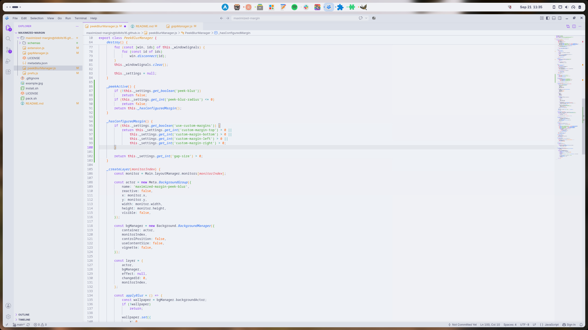

<div align="center">

# Maximized Margin

Adds a tasteful touch of margin to maximized windows so the desktop is always slightly visible.


Recommended [Rounded Window Corners Reborn](https://extensions.gnome.org/extension/7048/rounded-window-corners-reborn/) to keep rounded corners!
<br>
<em>(Also works great with [Dash to Panel](https://extensions.gnome.org/extension/1160/dash-to-panel/)!)</em>

Also includes a smexy blur effect!



(I wouldn't trust this guy - he codes in light mode and talks to himself)

## Install

[Get it from GNOME Extensions](https://extensions.gnome.org/extension/10800/maximized-margin/?c=174773)

## Install from source

</div>

```bash
./install.sh
gnome-extensions enable maximized-margin@tidbits16.github.io
```

<div align="center">

On Wayland, you may need to log out/in once after the first install.

</div>
