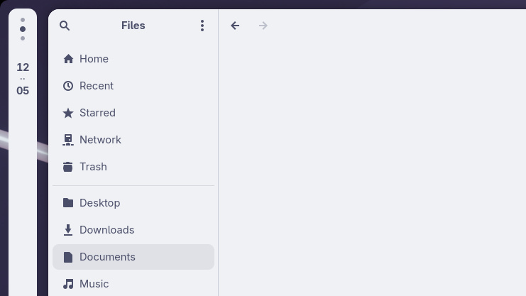

<div align="center">

# Maximized Margin

Adds a tasteful touch of margin to maximized windows so the desktop is always slightly visible.



Recommended with [Rounded Window Corners Reborn](https://extensions.gnome.org/extension/7048/rounded-window-corners-reborn/).
<br>
<em>(Also works great with [Dash to Panel](https://extensions.gnome.org/extension/1160/dash-to-panel/)!)</em>

## Install

GNOME Extensions link coming soon.

## Install from source

```bash
./install.sh
gnome-extensions enable maximized-margin@tidbits16.github.io
```

On Wayland, you may need to log out/in once after the first install.

</div>
